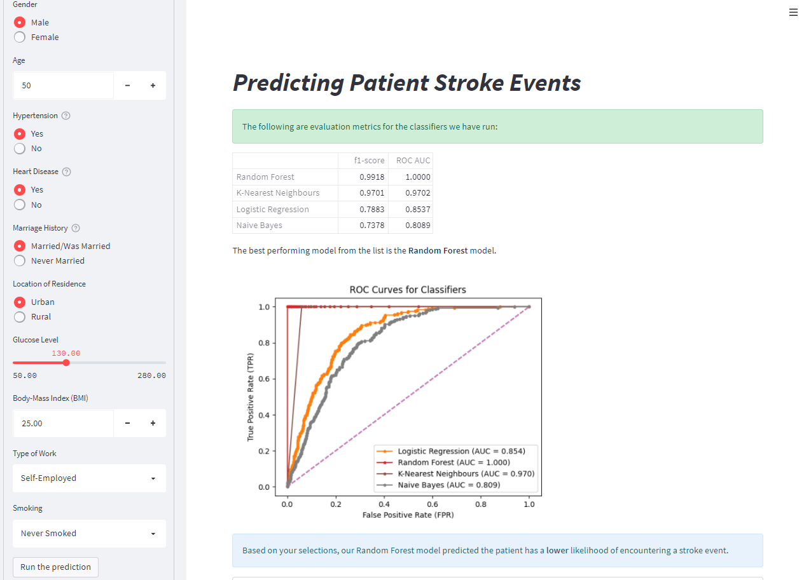

## Class Predictions for Stroke Events
_Last Update: Aug 2022_

### <ins>About</ins>
This web-application runs four pre-selected classifiers on a dataset of patient data and provided stroke event outcomes, and visualizes the scoring results from model training and testing. From the four models, one is selected based on score, and used to run a prediction on user-defined patient parameters (e.g. age, BMI).

This app is built on the Streamlit python web framework, and published on Streamlit Cloud, accessible [here](https://jasonlimcp-classifier-streamlit-app-il6dwj.streamlitapp.com/).

Documentation for data preparation logic can be found in the EDA Jupyter notebook.

### <ins>Data Source</ins>
Data used in /data is contributed from Fedesoriano on [Kaggle](https://www.kaggle.com/datasets/fedesoriano/stroke-prediction-dataset). The primary source of stroke patient data is confidential.

### <ins>Python Package Requirements</ins>
streamlit 
pandas 
numpy 
scikit-learn 
matplotlib 
imblearn 

### <ins>Disclaimer</ins>
This project is solely for educational purposes on machine learning concepts. Content should not be construed or relied upon as medical information, advice or opinion in any form.

### <ins>Appendix: Classification Algorithms</ins>
The target variable is a binary class-label "stroke", indicating the stroke or non-stroke outcome of an observed patient.
1. **Logistic Regression**
 Logistic Regression classifies by calculating the probability of each class, using a logistic function. Logistic regression is most useful for modelling the impact of several independent variables on a single target variable, which fits this scenario. Logistic regression is, however, prone to overfitting, as it assumes all predictors are independent. Data preparation needs to ensure patient input variables do not exhibit multi-collinearity.
2. **Gaussian Naive Bayes**
 Naive Bayes operates with the assumption of independence between every pair of variables. It is an efficient estimator, and can work with smaller training datasets, albeit performance may not match more complex classifiers. This classifier might be a suitable choice for deploying in low-cost predictive systems.
3. **Random Forest**
 The Random Forest classifier fits a number of decision trees on subsets of the data (with replacement), and uses averages to improve the predictive accuracy of the model. This in turn controls over-fitting. This model was considered over the base decision tree classifier for this reason. Potential drawbacks may include slower classifier speed, however this use case does not require real-time prediction.
6. **K-Nearest Neighbours**
 K-Neighbours (KNN) classification is computed from a simple majority vote of the k nearest neighbours of each point, which can be configured. This algorithm is robust to noisy training data and effective for large training datasets. However, the model needs several iterations to determine the optimal value of K, leading to a higher computation cost. 

### <ins>Appendix: Model Evaluation</ins>
Confusion matrix evaluation is used for the following performance measures:
1. True Positive Rate (TPR) / False Positive Rate(FPR): Used to calculate ROC curve and subdequently Area Under Curve (AUC)
2. Precision / Recall: Used to calculate the F-measure or F-score [2 / (1 / Precision) + (1 / Recall)]
  These two metrics are used as our main evaluation criteria for a suitable classifier for predicting patient mortality outcomes. In particular, we prioritize the F-score over Accuracy as it deals better with imbalanced class distribution, which is partially true for this dataset. The AUC is used to evaluate model quality (assigns higher probability to random positive than a negative, on average). Finally, we used a weighted-average score for the F1-score, to consider the proportion for each class label.